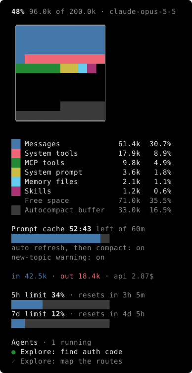

# klod

A personal [Claude Code](https://claude.com/claude-code) mod: a side pane showing the context window live.



## Install

```sh
git clone https://github.com/iSach/klod.git ~/.claude/mods
```

Then in `~/.claude/settings.json`:

```json
"env": { "CLAUDE_CODE_PLUGIN_DIRS": "~/.claude/mods/klod" }
```
